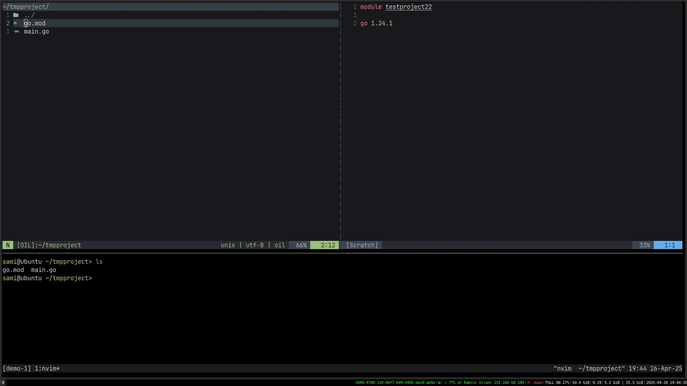

# cmp-go-deep

A GoLang ```deep-completion``` source for [nvim-cmp](https://github.com/hrsh7th/nvim-cmp) / [blink.cmp](https://github.com/Saghen/blink.cmp), that works alongside [cmp-nvim-lsp](https://github.com/hrsh7th/cmp-nvim-lsp) / [blink.cmp](https://github.com/Saghen/blink.cmp)'s LSP source and provides completion suggestions for <b> "<i>UNIMPORTED</i> LOCAL, INTERNAL, AND VENDORED PACKAGES ONLY".</b> 

#### Why?

At the time of writing, the GoLang Language Server (```gopls@v0.18.1```) doesn't seem to support deep completions for unimported pacakges. For example, with deep completion enabled, typing ```'cha'``` could suggest ```'rand.NewChaCha8()'``` as a possible completion option - but that is not the case no matter how high the completion budget is set for ```gopls```.


#### How?


Query  ```gopls's``` ```workspace/symbol``` endpoint, cache the results using ```sqlite```, convert the resulting ```SymbolInformation``` into ```completionItemKinds```, filter the results to only include the ones that are unimported, then finally feed them back into ```nvim-cmp``` / ```blink.cmp```

---
⚠️ <i> it might take a while for the packages to be indexed by gopls in huge codebases </i>
#### Demo

* Note: Due to how gopls indexes packages, completions for standard library packages are not available until at least one of them is manually imported.
<p align="center">
  
</p>

---
## Requirements
- [nvim-cmp](https://github.com/hrsh7th/nvim-cmp) OR [blink.cmp](https://github.com/saghen/blink.cmp)
- [sqlite.lua](https://github.com/kkharji/sqlite.lua)

## Setup
#### Lazy.nvim
##### - nvim-cmp
```lua
{
    "hrsh7th/nvim-cmp",
    dependencies = {
	{ "samiulsami/cmp-go-deep", dependencies = { "kkharji/sqlite.lua" } },
    },
    ...
    require("cmp").setup({
        sources = {{
            name = "go_deep",
            ---@module "cmp_go_deep"
	    ---@type cmp_go_deep.Options
            option = {
                -- See below for configuration options
            },
        }},
    })
}
```
##### - blink.cmp <i>(requires saghen/blink.compat)</i>
```lua
{
	"saghen/blink.cmp",
	dependencies = {
		{ "samiulsami/cmp-go-deep", dependencies = { "kkharji/sqlite.lua" } },
		{ "saghen/blink.compat" },
	},
	opts = {
		sources = {
			default = {
				"go_deep",
			},
			providers = {
				go_deep = {
					name = "go_deep",
					module = "blink.compat.source",
					---@module "cmp_go_deep"
					---@type cmp_go_deep.Options
					opts = {
						-- See below for configuration options
					},
				},
			},
		},
	},
}
```
### Default options
```lua
{
	-- Enable/disable timeout notifications.
	timeout_notifications = true,

	-- How to get documentation for Go symbols.
	-- options:
	-- "hover" - LSP 'textDocument/hover'. Prettier.
	-- "regex" - faster and simpler.
	get_documentation_implementation = "hover",

	-- How to get the package names.
	-- options:
	-- "treesitter" - accurate but slower.
	-- "regex" - faster but can fail in edge cases.
	get_package_name_implementation = "regex",

	-- Whether to exclude vendored packages from completions.
	exclude_vendored_packages = false,

	-- Timeout in milliseconds for fetching documentation.
	-- Controls how long to wait for documentation to load.
	documentation_wait_timeout_ms = 100,

	-- Maximum time (in milliseconds) to wait before "locking-in" the current request and sending it to gopls.
	debounce_gopls_requests_ms = 100

	-- Maximum time (in milliseconds) to wait before "locking-in" the current request and loading data from cache.
	debounce_cache_requests_ms = 250
	-- Path to store the SQLite database

	-- Default: "~/.local/share/nvim/cmp_go_deep.sqlite3"
	db_path = vim.fn.stdpath("data") .. "/cmp_go_deep.sqlite3",

	-- Maximum size for the SQLite database in bytes.
	db_size_limit_bytes = 200 * 1024 * 1024, -- 200MB
}
```
---
#### TODO
- [x] Cache results for faster completions.
- [ ] Cross-project cache sharing for internal packages
- [ ] Better memory usage
- [ ] Remove the indirect dependency on ```cmp-nvim-lsp``` or ```blink.cmp's``` LSP source.
