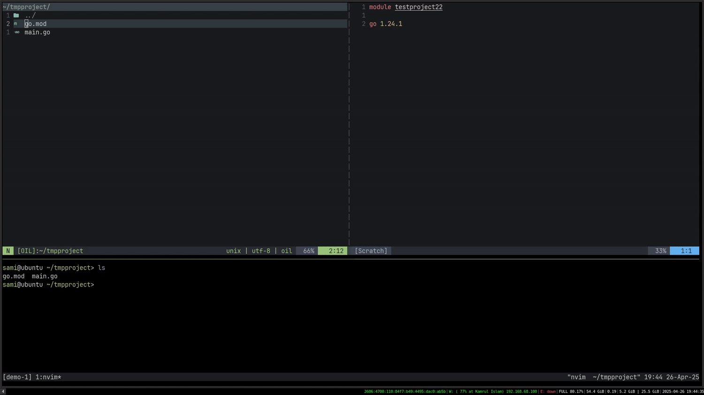

# cmp-go-deep

A Go ```deep-completion``` source for native Neovim completion, that works alongside Neovim's built-in LSP completion and provides completion suggestions for <b> "<i>UNIMPORTED</i> LOCAL, INTERNAL, AND VENDORED PACKAGES ONLY".</b>

#### Why?

At the time of writing, the Go Language Server (```gopls@v0.21.0```) doesn't seem to support deep completions for unimported packages. For example, with deep completion enabled, typing ```'cha'``` could suggest ```'rand.NewChaCha8()'``` as a possible completion option - but that is not the case no matter how high the completion budget is set for ```gopls```.


#### How?


Query  ```gopls's``` ```workspace/symbol``` endpoint, cache the results using ```sqlite```, convert the resulting ```SymbolInformation``` into native completion items, filter the results to only include the ones that are unimported, then finally feed them back into native Neovim completion through ```completefunc```

---
⚠️ <i> it might take a while for the packages to be indexed by gopls in huge codebases </i>
#### Demo

* Note: Due to how gopls indexes packages, completions for standard library packages are not available until at least one of them is manually imported.
<p align="center">
  
</p>

---
## Requirements
- Neovim master / 0.13+
- [sqlite.lua](https://github.com/kkharji/sqlite.lua)
- Neovim Treesitter module with the Go parser installed

## Setup
#### Lazy.nvim
```lua
{
	"samiulsami/cmp-go-deep-native-completion",
	dependencies = {
		"kkharji/sqlite.lua",
	},
	config = function()
		vim.g.cmp_go_deep = {
			-- See below for configuration options
		}

		vim.api.nvim_create_autocmd("LspAttach", {
			callback = function(ev)
				local client = vim.lsp.get_client_by_id(ev.data.client_id)
				if client and client.name == "gopls" and vim.bo[ev.buf].filetype == "go" then
					require("cmp_go_deep").attach_to_buffer(ev.buf)
				end
			end,
		})
	end,
}
```
### Default options
```lua
{
	-- Enable/disable notifications.
	notifications = true,

	-- How to get the package names.
	-- options:
	-- "treesitter" - accurate.
	get_package_name_implementation = "treesitter",

	-- Whether to exclude vendored packages from completions.
	exclude_vendored_packages = false,

	-- Whether to exclude internal packages that cannot be imported.
	-- Follows Go's internal package rule: code can only import from "internal"
	-- if it's in a subtree rooted at the parent of "internal".
	exclude_internal_packages = true,

	-- Maximum time (in milliseconds) to wait before "locking-in" the current request and sending it to gopls.
	debounce_gopls_requests_ms = 0,

	-- Path to store the SQLite database
	-- Default: "~/.local/share/nvim/cmp_go_deep.sqlite3"
	db_path = vim.fn.stdpath("data") .. "/cmp_go_deep.sqlite3",

	-- Enable/disable debug behavior.
	debug = false,

	-- Minimum completion prefix length.
	min_keyword_length = 3,

	-- Maximum number of completion items returned.
	max_items = 10,
}
```
---
#### TODO
- [x] Cache results for faster completions.
- [x] Cross-project cache sharing for internal packages.
- [x] Better memory usage.
- [x] Don't ignore package names while matching symbols.
- [ ] Fix stuttering.
- [ ] Archive after [this issue](https://github.com/golang/go/issues/38528) is properly addressed.
